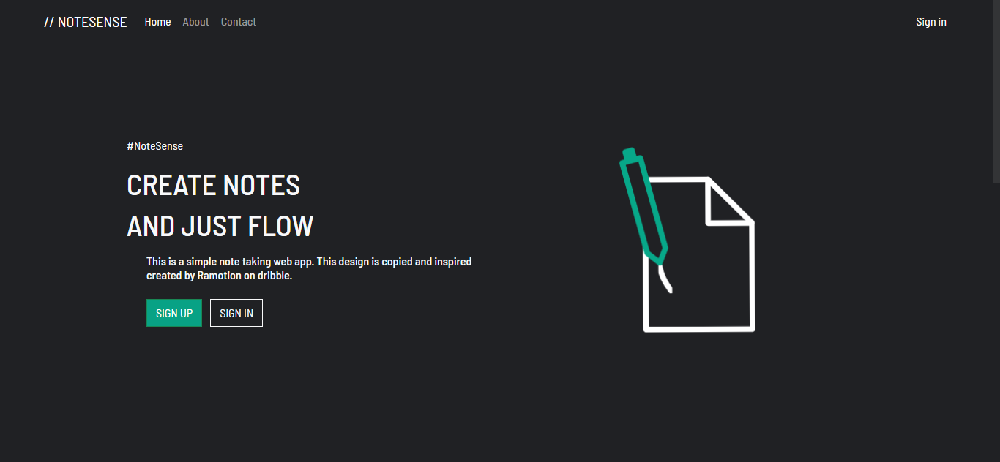
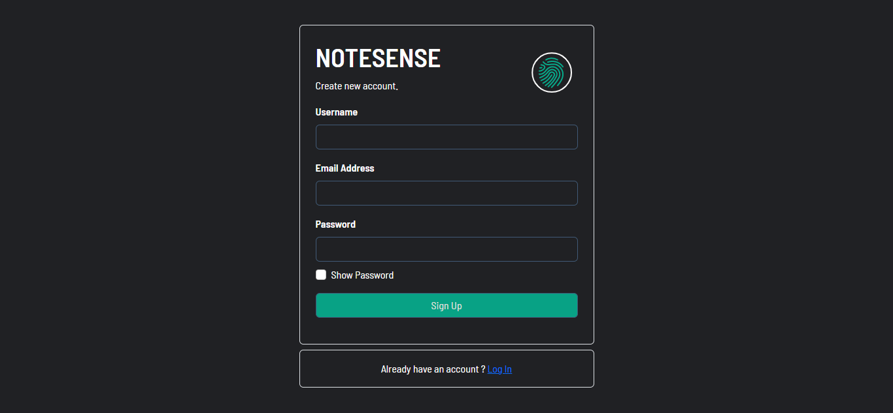
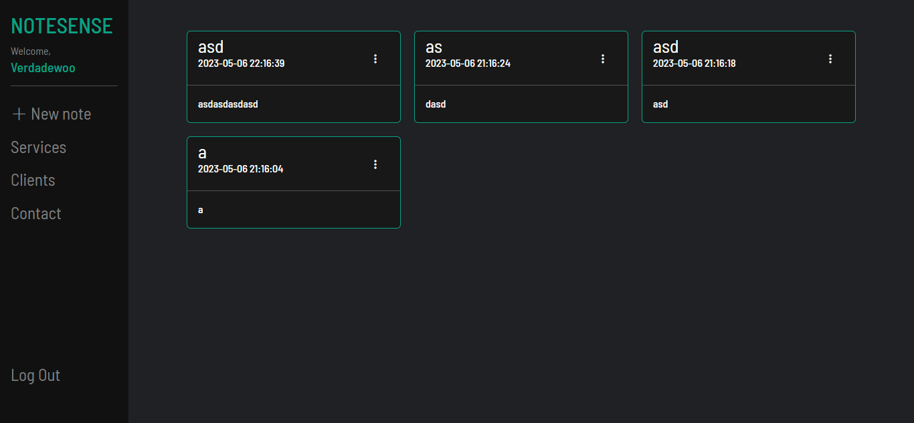

# Notesense Web App
Note app with user login and registration system built using PHP and MySQL.

**Live Project URL -** 
[Notesense](http://notesense.epizy.com/notesense.php)

## Roadmap
- [x] Add user login
- [x] Add note creation
- [ ] Update about page
- [ ] Add tags to notes
- [ ] Update interface
    - [ ] Update alert message
    - [ ] Update mobile UI
### Built With
* [![Bootstrap][Bootstrap.com]][Bootstrap-url]

## Screenshots

### Built With

This section should list any major frameworks/libraries used to bootstrap your project. Leave any add-ons/plugins for the acknowledgements section. Here are a few examples.

* [![Next][Next.js]][Next-url]
* [![React][React.js]][React-url]
* [![Vue][Vue.js]][Vue-url]
* [![Angular][Angular.io]][Angular-url]
* [![Svelte][Svelte.dev]][Svelte-url]
* [![Laravel][Laravel.com]][Laravel-url]
* [![Bootstrap][Bootstrap.com]][Bootstrap-url]
* [![JQuery][JQuery.com]][JQuery-url]

(<a href="#readme-top">back to top</a>)

